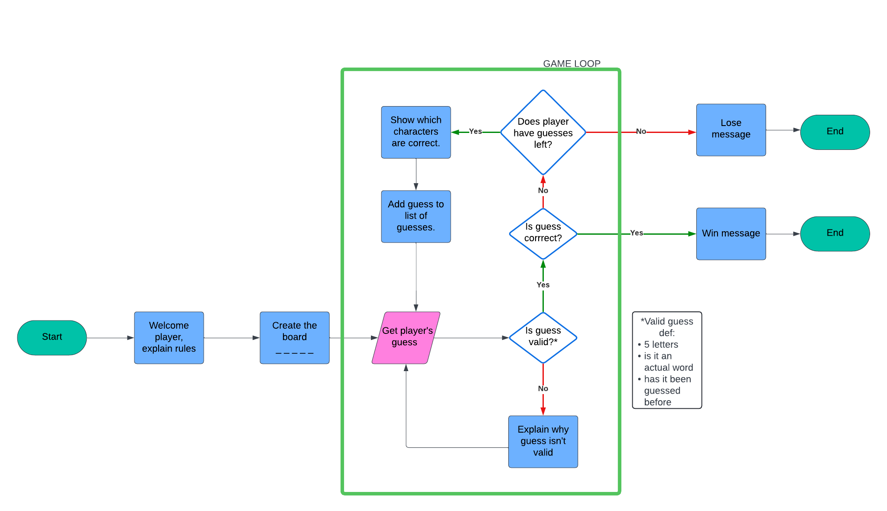

# Wordle

## Game play
This game is based on the popular online game Wordle. 

The user can choose how many letters long the word is, and how many guesses you're allowed, in order to change the game difficulty. 

After each guess the user will be given some feedback to help with making their next guess.

A letter in lowercase means it is a correct letter but in the wrong place.
A letter in UPPERCASE means it is a correct letter in the correct place.

[Here is the live version of my project.](https://wordle-emily-1206e1bbe7cb.herokuapp.com/)

---
## Steps
I began by planning out the flow of my project using Lucidchart. I created this flowchart to help me understand the methods and functions that would be required. 

---
## Features
### Board class
- I used a Board class to encapsulate all of the functionality of the game.
- The __init__ method initialises the game board with parameters such as word length and number of guesses allowed. It sets up the board as a list of underscores representing unknown letters. It also tracks guesses used, guesses taken so far, and valid words that can be guessed.
- the print_board method prints the current state of the board.
- The load_words and choose_random_word methods are used to open the words.txt file, load the valid words into a list and randomly select a word  using the random package, based on the length provided by the user. 
- The make_guess method uses a while loop to take user input for a guess, validate the guess against game rule (length, uniqueness) and update the parameters set in __init__ method.
- The give_feedback method uses a for loop iterating over the letters in the guess. It provides feedback on the correctness of the guessed word, marking correct letters in correct positions with uppercase, correct letter in wrong positions with lowercase, and underscores for incorrect guesses. 

### Utility functions
- The validate_choice function checks if a given choice is within a list of valid options.
- The get_valid_input function continuously prompts the user until a valid input is received. It uses a try/except statement to produce a ValueError if the validate_choice function does not return a valid option. 

### Game setup
- The game_setup function initialises the game by prompting the player's name and choices for difficulty.
- It reuses the get_valid_input function to check to validity.

### Main function
- This function sets up the game, creating an instance of 'Board' with chosen parameters and randomly selecting a word for the player to guess.
- It then enters a while loop where the player makes guesses until they either guess the word correctly of run out of guesses. 

---
## Testing
- Manually passed code through PEP8 Linter to confirm there are no errors.
- Given invalid inputs (words not in the list, words longer/shorter than length, words already guessed) to check validation works.
- Tested my local terminal and Code Institute Heroku terminal.

---
## Resolved bugs
- I had to wrap print statements in order to resolve errors from PEP8 Linter for lines being too long.
- Initially the feedback was only providing lowercase letters, even when letters were in the correct location. I added the line `chosen_word_copy[i] = None` in order to mark the letter as "used" so it would then not be used in the next feedback step, overriding the uppercase instruction. 

---
## Deployment
This project was deployed using Code Institute's mock terminal for Heroku.

---
## Credits
- Code Institute for the deployment terminal.
- Code Institute for the inspiration of the Battleships game!
- [This post](https://www.reddit.com/r/learnpython/comments/yvv9f5/generate_random_word_of_specific_length/) for providing the file for the [words list](https://raw.githubusercontent.com/dwyl/english-words/master/words_alpha.txt) and the code for returning words of a valid length. 

